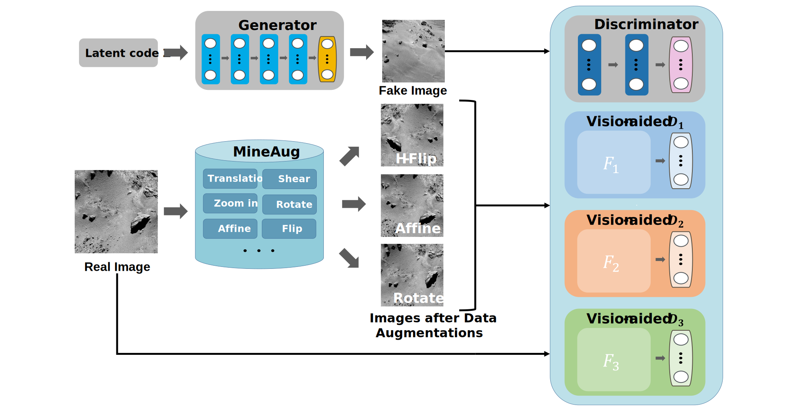
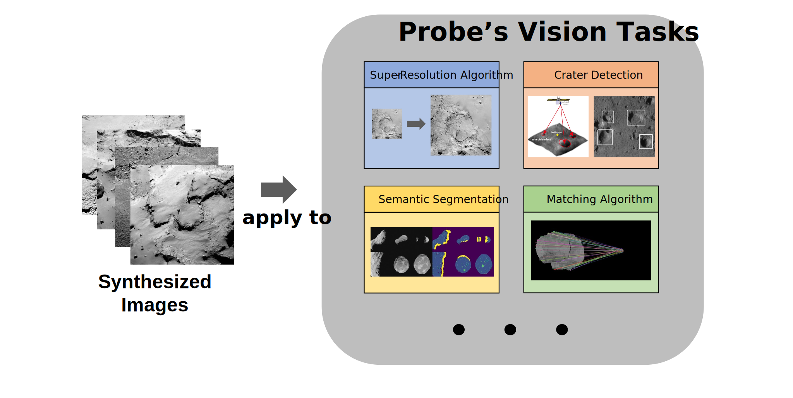

# SCB-GAN: A High-quality Small Celestial Body Surface Image Synthesis Method
<p align="center">

</p>

### SCB-GAN: A High-quality Small Celestial Body Surface Image Synthesis Method [[Paper]](https://ieeexplore.ieee.org/document/10196052)

> Abstract: Small celestial body (SCB) exploration is a research hotspot in deep space exploration technology. However, the scarcity of small celestial body surface images severely hinders the development of probe intelligence systems, and it is challenging to redeploy probes to obtain massive images due to the high cost. In recent years, with the growth of deep learning, generative adversarial networks have shown excellent potential in generating real images. This paper presents a high-quality small celestial body surface image synthesis method SCB-GAN, which can generate a massive amount and large diversity of small celestial body surface images that match human perception from a limited dataset. Specifically, we propose MineAug, which can automatically select appropriate data augmentations from the given SCB surface imageset based on an efficient mining mechanism, improving the robustness of the GAN training process. We also add the vision-aided loss to our network to further improve image quality. Through extensive experiments, our method outperforms recent methods under a variety of metrics in terms of visual quality comparison, no-referenced image quality assessment, and human subjective evaluation, which has significant implications for the development of intelligent systems. 

## <a id="Dataset-Information">Dataset Information</a>

The two datasets (**Rosetta2495.zip** and **Dawn2500.zip**) are preprocessed by [dataset_tool.py](./dataset_tool.py) and **can be used directly for training SCB-GAN**. 

| **Dataset** | **Small Celestial Body** | **Mission** | **Agency** | **Number of Images** | **Selected Data Augmentations** | **Download Link** |
|:---:|:---:|:---:|:---:|:---:|:---:|:---:|
| Rosetta2495 | 67P/Churyumov Gerasimenko | Rosetta | European Space Agency | 2495 | Horizon Flip, Affine, Rotate | [Google Drive](https://drive.google.com/file/d/1osAMpxdzJiIgNbuepIsi-oBZAakf8gO6/view?usp=share_link) |
| Dawn2500 | Vesta and Ceres | Dawn | National Aeronautics and Space Administration | 2500 | Horizon Flip, Translation Vertical, Zoom in | [Google Drive](https://drive.google.com/file/d/1dOiFh2Qh9uumCpPvQPydpLKaN3F0zggr/view?usp=share_link) |


## Getting started

#### <a id="Step1">Step 1</a>: Select appropriate data augmentations from the given SCB surface imageset by MineAug.
(This step is **unnecessary** since you can directly refer to the [Information](#Dataset-Information) and proceed with the [Step 2](#Step2) directly.)

Run [Execute DA.ipynb](./Execute%20DA.ipynb) and [Select DA.ipynb](./Select%20DA.ipynb) in sequence.
The best **K** data augmentations selected by MineAug for **Rosetta2495** and **Dawn2500** are shown in the table above.

#### <a id="Step2">Step 2</a>: Train new SCB-GAN with the given datasets.

You can use the following command to train SCB-GAN. 
The training took about **5days** on four Nvidia Tesla V100 (16GB) GPUs with a batch size of 16.

```.bash
# train SCB-GAN with Rosetta2495 (Fig.6)
 python vision-aided-gan.py --outdir /outdir --data /Rosetta2495.zip --cfg paper256_2fmap  --aug ada --augpipe bgc --augcv ada --batch 16 --gpus 4 
 --kimgs-list '4000,2000,2000'  --num 3 --mineaug --augmentations-list 'HorizontalFlip,RandomAffine,Rotate'

 # train SCB-GAN with Dawn2500 (Fig.7)
python vision-aided-gan.py --outdir /hy-tmp/models/ --data /Dawn2500.zip --cfg paper256_2fmap  --aug ada --augpipe bgc --augcv ada --batch 16 --gpus 4 
--kimgs-list '4000,2000,2000'  --num 3 --mineaug --augmentations-list 'HorizontalFlip,Translation_y,Zoom_in'
```

#### <a id="Step3">Step 3</a>: Calculate quality metrics
```.bash
# calculate metrics of SCB-GAN trained with Rosetta2495 （Table IV）
python calc_metrics.py --metrics=fid50k_full,kid50k_full,pr50k3_full --data=/Rosetta2495.zip --network=/network-snapshot-best.pkl

# calculate metrics of SCB-GAN trained with Dawn2500（Table IV）
python calc_metrics.py --metrics=fid50k_full,kid50k_full,pr50k3_full --data=/Dawn2500.zip --network=/network-snapshot-best.pkl
```

### Future application

<p align="center">

</p>

We have generated 5,000 images for each of the two datasets (**Rosetta2495** and **Dawn2500**) using the pretrained SCB-GAN, which will provide a sufficient source of high-quality SCB surface images for future research related to the deep space field.
| **Dataset** | **Download link of generated 5k samples** |
|:---:|:---:|
| Rosetta | [Google Drive](https://drive.google.com/file/d/1CrXfVsBXy2MmhmlmRlePbsCxVEirhXod/view?usp=share_link) |
| Dawn | [Google Drive](https://drive.google.com/file/d/1Pn3Q4GxUAIfK9Beef7kgV0CG_dreBdVs/view?usp=share_link) |

### Acknowledgments
We express our gratitude to Jingmin Zhang for her invaluable assistance in creating the figures, as well as to the ten researchers who aided us in conducting the human subjective evaluation. Additionally, we would like to extend our heartfelt appreciation to the associate editor and reviewers for generously devoting their valuable time and effort to meticulously review our manuscript. Our codebase is built on [Vision-aided GAN](https://github.com/nupurkmr9/vision-aided-gan) and [StyleGAN2-ada](https://github.com/NVlabs/stylegan2-ada-pytorch).
